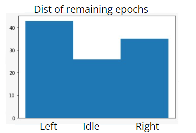
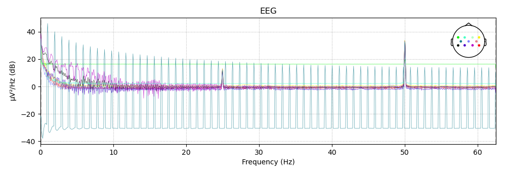
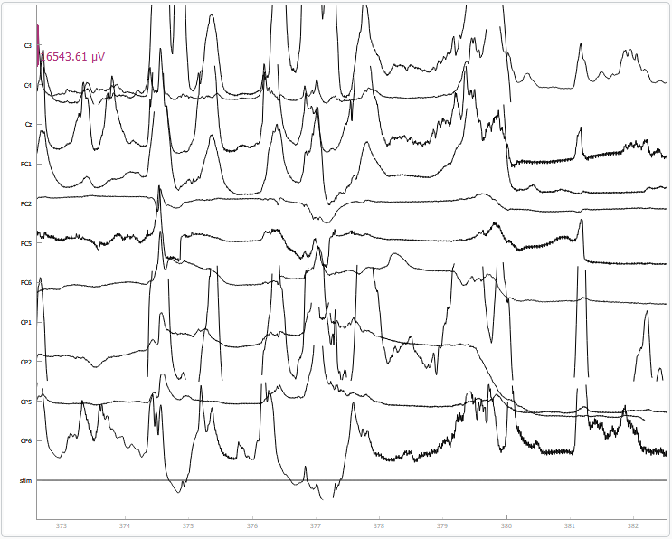
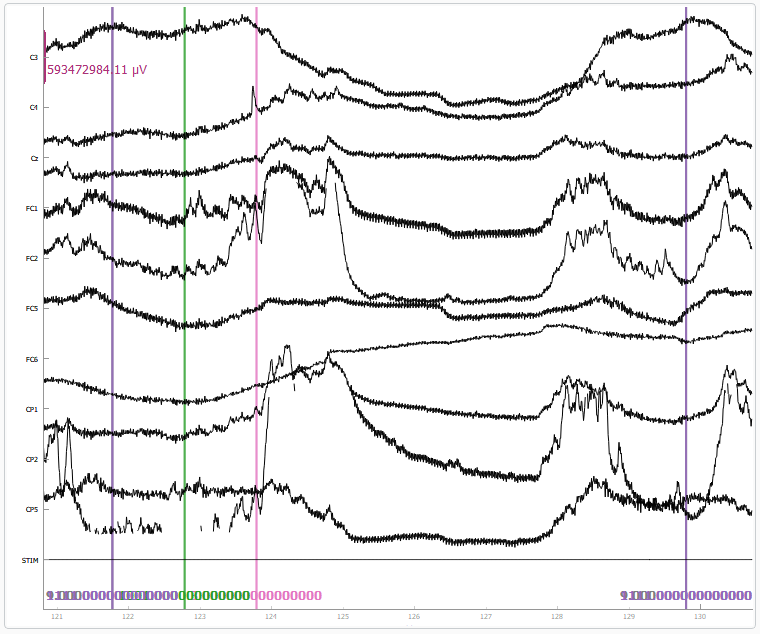
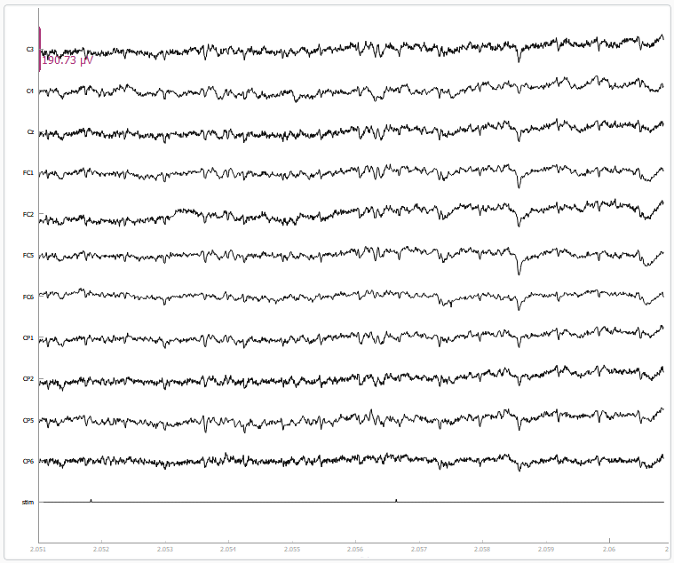

# _Data_ 
#### This README's purpose is to describe the raw data files.

## General
___
In general, over 900 trial were recorded from the mentor, out of them around 100 were not dropped during preprocessing.
In addition, most remaining trails were either 'LEFT' or 'RIGHT':  

## Mentor Python Recordings
___
Most recordings from the mentor were obtained using the python CytonRecorder class and are saved in the format **Subject_yyyy-mm-dd-hh-mm_raw.fif**.

### 28-04-2022:
* 270 trials in 4 different recordings.
* Due to an indices problem, the raw files channel names were saved with an offset such that the first channel which should be C3 is actually irrelevant and C3 was saved in the second channel. C4 is in the third and so on, so that CP6 is missing in all of these files.  

### 08-05-2022:
* 240 trials in 3 different recordings.
* Here all channels are present but a lot of the recording is very noisy:  

### 15-05-2022:
* 369 trials in 5 different recordings.
* Data is very noisy as well.

## Matlab Recordings
A small portion of recordings from the mentor were obtained using the python CytonRecorder class and are saved in the format **Subject_yyyy-mm-dd-hh-mm_raw.fif**.
___
* Saved in the directory 'xdf_files'
* 54 trials in 3 different recording.
* The amplitude values in the matlab recordings differ greatly than those in the python recordings. We tried combining them by normalizing the data, but eventually decided to treat each data set differently.
* The signal here is also not good (either very flat or very noisy):  

## Sivan's Python Recordings
___
* In the directory named Sivan there are recording files which are not from the mentor, but from Sivan, a team member.
* 720 events in 12 different recordings.
* Very good data:  
